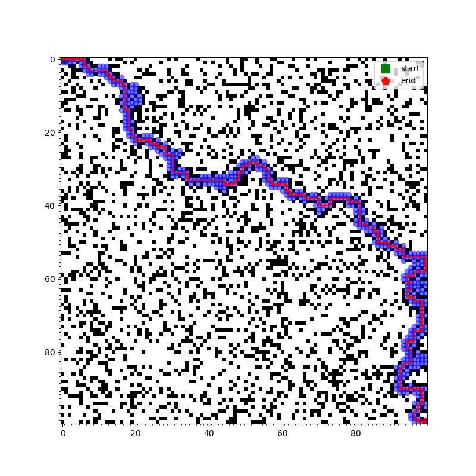
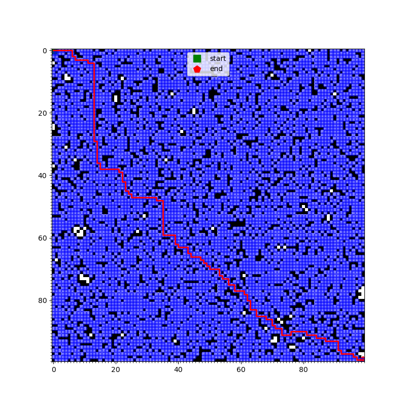
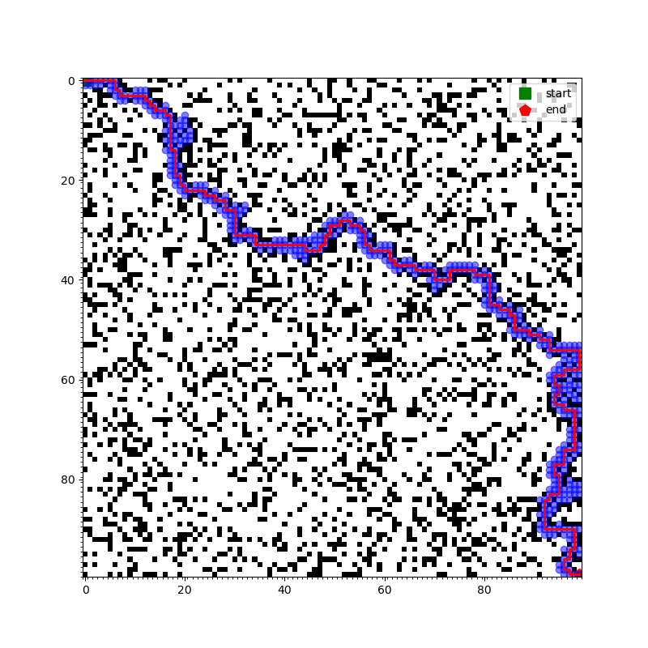
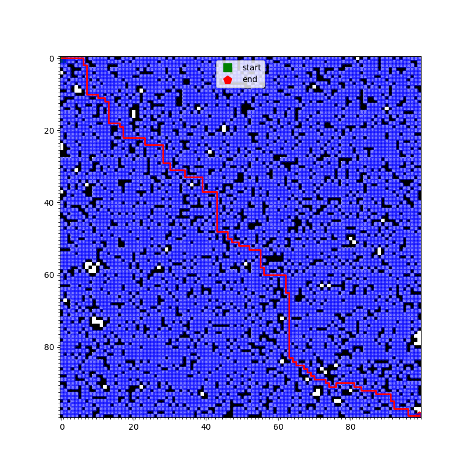
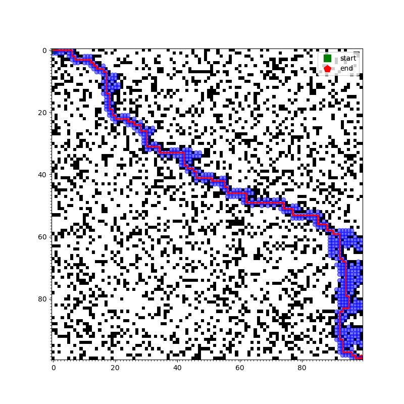
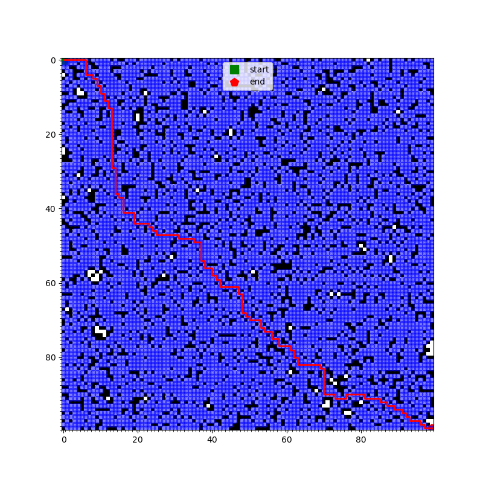
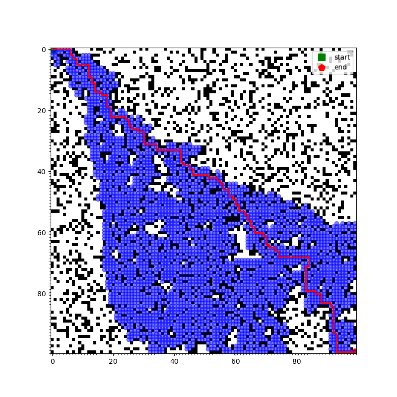
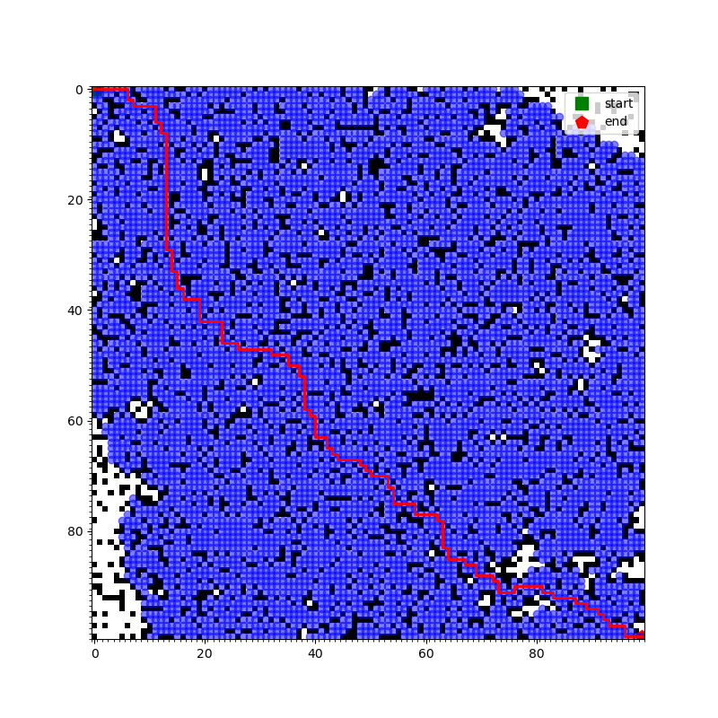
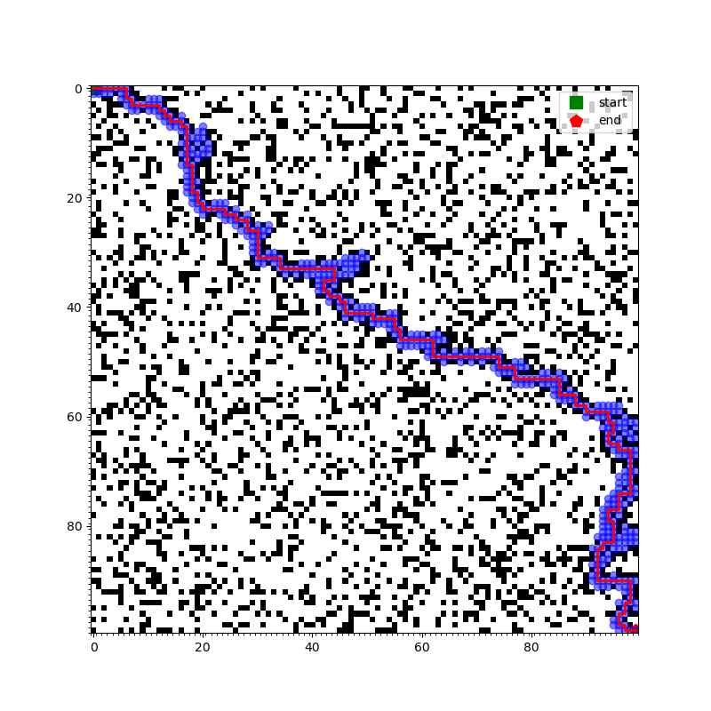
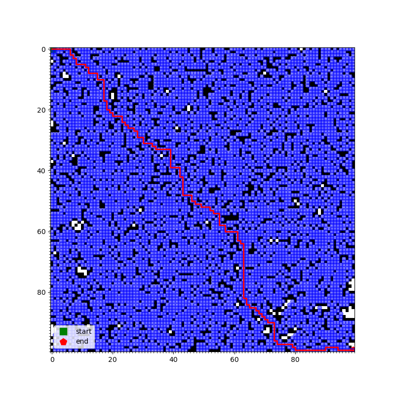

# A-Star Quick Demo

When I code the A-Star algorithm, I found that maybe just `f = g + h` is not good enough for the balance between "breadth first search" and "heuristic function" , which means:

- `f` we can think of it as the priority of the current point
  - we just need to select the point with the lowest `f` value
  - by the package `heapq` in python, we can easily process the priority queue
  - and always select the point with the lowest `f` value
  - the node with lower `f` value is more likely to be selected as the next point
- `g` is the cost from the start point to the current point
  - the number of steps from the start point to the current point
  - the less steps, the higher priority
- `h` is the heuristic function, which is the estimated cost from the current point to the end point.
  - heuristically, we use the Manhattan distance as the heuristic function
  - the less cost, the higher priority

The problem of just `f = g + h` is sometimes the weight of `g` and `h` is not balanced, because we always want our algorithm find a good-enough path as soon as possible or find the best path regardless of the cost of time, so we need to balance the weight of `g` and `h`.

So I simply add a parameter `alpha` to balance the weight of `g` and `h`, the new formula is `f = g * alpha +  h * (1 - alpha)`, the weight `alpha` is in the range of `[0, 1]`.

- when `alpha = 1`, the algorithm is just like the breadth first search
  - the less-steps node in the unvisited list is always selected first
- when `alpha = 0`, the algorithm is just like the heuristic search
  - the node with the lowest heuristic value is always selected first

And I test the little-modified algorithm on the following settings:

- 21 `alpha` values, `[0, 0.05, 0.10, ..., 0.95, 1]`
- on a random 100x100 map, with 25% obstacles (I use the seed of `1337` to generate the map)

You can reproduce the results by running the following command:

```shell
python main.py
```

The results are shown below.

| `alpha` |  Time/s | Length/step | `alpha` |  Time/s | Length/step | `alpha` |  Time/s | Length/step |
| ------- | ------- | ----------- | ------- | ------- | ----------- | ------- | ------- | ----------- |
| 0.00    | 0.14966 | 245         | 0.35    | 0.22819 | 219         | 0.70    | 3.09626 | **201**         |
| 0.05    | 0.14824 | 245         | 0.40    | 0.15804 | 213         | 0.75    | 3.06603 | **201**         |
| 0.10    | 0.14795 | 245         | 0.45    | 0.16404 | 205         | 0.80    | 3.06557 | **201**         |
| 0.15    | 0.20337 | 223         | 0.50    | 1.34140 | **201**         | 0.85    | 3.08679 | **201**         |
| 0.20    | **0.13985** | 223         | 0.55    | 2.53221 | **201**         | 0.90    | 3.06253 | **201**         |
| 0.25    | 0.14203 | 223         | 0.60    | 3.07184 | **201**         | 0.95    | 3.08335 | **201**         |
| 0.30    | 0.19712 | 219         | 0.65    | 3.08154 | **201**         | 1.00    | 2.55288 | **201**         |

Though all the `alpha` values can find the path from the start point to the end point, the time cost and the distance cost is different. You can see that

- when `alpha = 0.20`, the algorithm is the fastest, but the path is not the shortest
- when `alpha = 0.50`, the path is the shortest, but the time cost is not the lowest
- and when `alpha = 0.45`, it get a good balance between the time cost and the distance cost
  - use just 10% of the time cost of `alpha = 0.50`
  - and the path is just 4 steps longer than `alpha = 0.50`

The result imags are shown below.

| `alpha` | Image | `alpha` | Image | `alpha` | Image |
| ------- | ----- | ------- | ----- | ------- | ----- |
| 0.00    |  | 0.35    |  | 0.70    |  |
| 0.05    |  | 0.40    |  | 0.75    |  |
| 0.10    |  | 0.45    |  | 0.80    |  |
| 0.15    |  | 0.50    |  | 0.85    |  |
| 0.20    |  | 0.55    |  | 0.90    |  |
| 0.25    |  | 0.60    |  | 0.95    |  |
| 0.30    |  | 0.65    |  | 1.00    |  |
